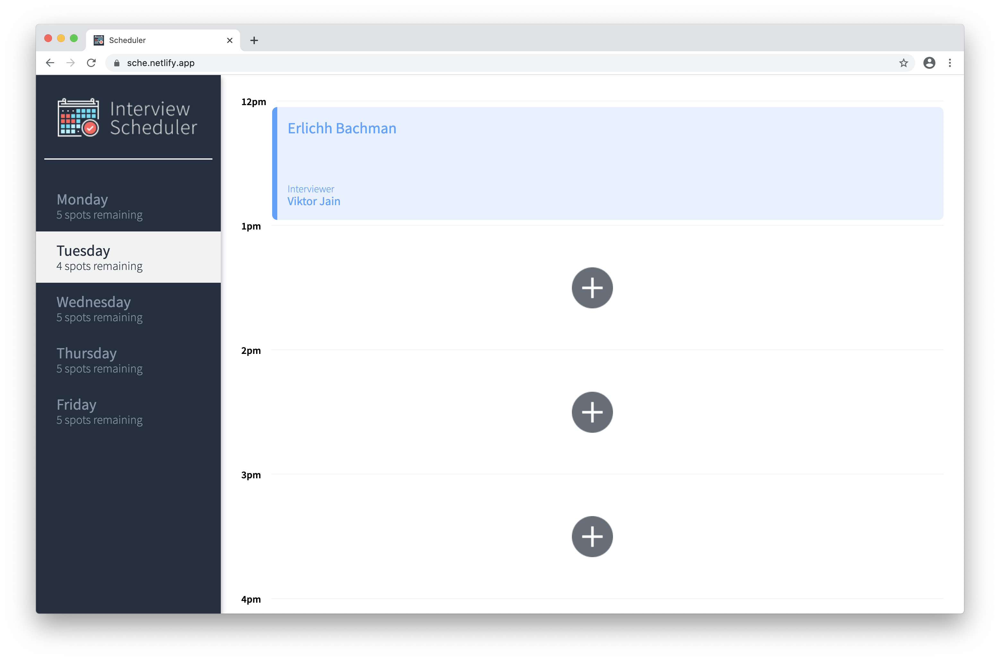

# Scheduler

Scheduler is a demo app built for the purpose of learning [React](https://reactjs.org/) using functional components and hooks. The live demo can be found [here](https://sche.netlify.app/). The backend api is hosted on Heroku and the frontend is hosted on Netlify. [CircleCI](https://circleci.com/) was implemented to run the testing suite each time changes are pushed to the master branch of the project.

### Frontend
The html content is rendered on the client side using the [ReactJS](https://reactjs.org/) framework/library. React allow the developer to create the interactive parts of the app in JavaScript and render the html needed as well as change the html elements quickly making the application dynamic.

### Backend
The back-end server is built using [node.js](https://nodejs.org) and [Express.js](https://expressjs.com/) - a node.js framework. The back-end serves as an API to the front end. The database used was [PostgreSQL](https://www.postgresql.org/).

### Testing
[Jest](https://jestjs.io/) was used for integration testing of the features and navigation within the app. As a secondary measure (and for learning purposes), [Cypress](https://www.cypress.io/) was used for end-to-end testing. [Storybook](https://storybook.js.org/) was used to build the components in isolation to ensure that they worked as intended. [ESLint](https://eslint.org/) was used for static testing.

## Screenshot

## Dependencies

- [express](https://www.npmjs.com/package/express)
- [PostgreSQL 9.x](https://www.postgresql.org/)
- [react](https://www.npmjs.com/package/react)
- [react-dom](https://www.npmjs.com/package/react-dom)
